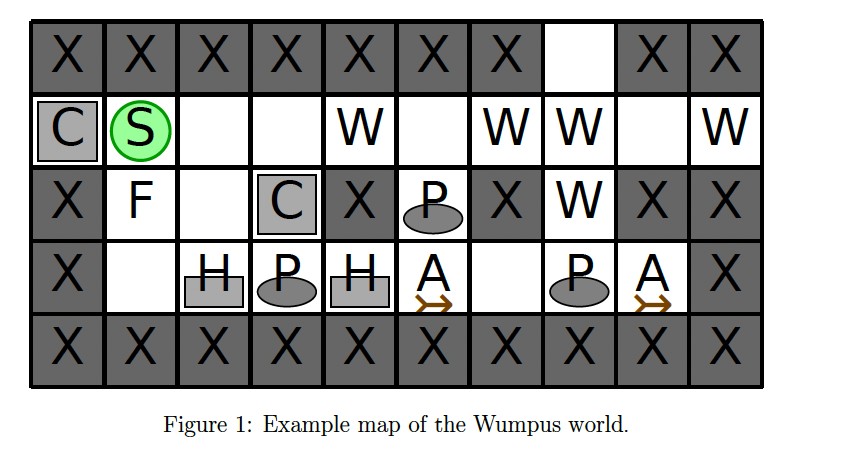

# Escape the Wumpus Cave - AI Systems Project

## Overview

This repository is dedicated to the AI Systems Project for the Winter Semester 2023/2024, led by Jan Frederik Schaefer at Friedrich-Alexander-Universität Erlangen-Nürnberg. The challenge involves navigating an agent out of a treacherous Wumpus world using Planning Domain Definition Language (PDDL) planning. The project emphasizes the understanding of PDDL, encoding of planning problems, and the utilization of planners to find solutions.

## Project Structure

- `escape_wumpus.ipynb`: A Jupyter notebook detailing the problem-solving approach, including map analysis, plan formulation, and results visualization.
- `problemgenerator.py`: Python script for generating PDDL problem files based on the Wumpus world maps provided in the assignment.
- `wumpus.pddl`: The domain file describing the rules and actions available in the Wumpus world.
- `mapXXX.pddl`: Generated problem files for each map in the assignment, describing the specific configuration of the Wumpus cave to escape from.
- `mapXXX.pddl.soln`: Solution files generated by the PDDL planner for each problem file.
- `mapXXX-solution.txt`: Text files containing the sequence of actions derived from PDDL solutions that guide the agent out of the cave.

## Installation & Dependencies

To set up the environment for running the solution:

1. Ensure Python 3 and Jupyter Notebook are installed.
2. Install necessary Python packages:
3. For PDDL planning, install Fast Downward or Pyperplan as per the instructions provided in the assignment.

## Running the Solution

1. Generate problem files using the `problemgenerator.py` script.
2. Solve each problem using a PDDL planner, such as Fast Downward, and generate solution files.
3. Convert PDDL solution files to actionable plans for the agent and verify their correctness using the notebook.

## How to Use

- To explore the problem-solving process, open `escape_wumpus.ipynb` in Jupyter Notebook and execute the cells.
- For generating new problem files or solving additional maps, run `problemgenerator.py` with the appropriate parameters.

## Contributions

Contributions to improve the solution or extend the project are welcome. Please ensure to follow the existing code structure and update documentation as necessary.

