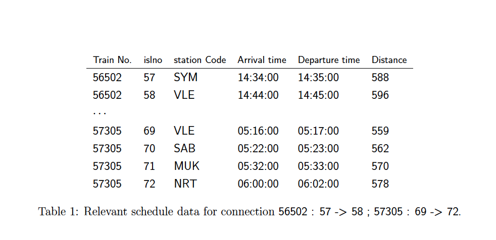

# Find the Best Train Connection

## Project Overview

This project, part of the AI-1 Systems Project for the Winter Semester 2023/2024 at Friedrich-Alexander-Universität Erlangen-Nürnberg, focuses on finding the best train connection between two places in India using different cost functions. The main objectives include working with graphs, solving a large real dataset search problem, implementing efficient algorithms, understanding the impact of cost functions on search algorithms, and handling CSV file formats.

 

### Dataset

The dataset, a modified version from Kaggle, represents the Indian railway timetable and includes details like train number, station codes, arrival and departure times, and distances. It is provided in CSV format.

### Problem Statement

Given a dataset of train schedules, the task is to find the best train connections based on various cost functions, such as the number of stops, distance, price, and arrival time.

## How to Run

### Dependencies

Ensure you have the following dependencies installed:

- Python 3.8+
- Pandas
- Numpy

You can install them using pip:

```bash
pip install pandas numpy
```

### Execution

To run the script and find the best train connections, execute the following command in the terminal:

```bash
python FindTrain_new.ipynb
```

Ensure you have the `schedule.csv`, `mini-schedule.csv`, `problems.csv`, and `example-problems.csv` files in the same directory as the script.

## Solution Approach

The approach includes implementing Dijkstra's algorithm for finding the shortest paths within the train network. Special considerations were made for handling train schedule times, station changes, and cost function calculations. The project highlights the importance of data preprocessing and algorithm optimization for handling large datasets.

### Evaluation

The implemented solution efficiently finds the best train connections for given start and end stations. The use of Dijkstra's algorithm proved effective, especially when adapted to handle different cost functions. One challenge encountered was optimizing the algorithm to reduce execution time for the extensive dataset. Future improvements might include exploring more advanced data structures for faster data access and experimenting with parallel processing.

## Conclusion

This project provides valuable insights into solving real-world search problems using graph algorithms. It demonstrates the significance of algorithm choice and optimization in dealing with large datasets and complex problem statements.

## References

- Indian Railways Time Table for trains available on Kaggle: [https://www.kaggle.com/harsh16/indian-railways-time-table-for-trains-available](https://www.kaggle.com/harsh16/indian-railways-time-table-for-trains-available)
- Dijkstra’s algorithm on Wikipedia: [https://en.wikipedia.org/wiki/Dijkstra's_algorithm](https://en.wikipedia.org/wiki/Dijkstra's_algorithm)
