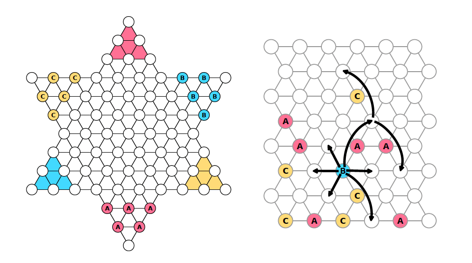

# FAUhalma Game Agent

This repository contains my solution for the FAUhalma game agent assignment as part of the AI-1 Systems Project course at Friedrich-Alexander-Universität Erlangen-Nürnberg.

## Assignment Description

The goal of this assignment is to implement an agent for a variant of the game Sternhalma/Chinese checkers called FAUhalma. The agent competes on a server and aims to move its pegs into the opposite corner (home) as quickly as possible. The game supports both two-player and three-player variants.

For more details about the assignment requirements and the game rules, please refer to the [assignment PDF](assignment-1.2.pdf).

## Solution Approach

My solution implements the Minimax algorithm with Alpha-Beta pruning to determine the best move for the agent. The key components of the solution include:

- Parsing the game state received from the server
- Generating legal moves based on the current game state
- Evaluating the game state using a heuristic function
- Implementing the Minimax algorithm with Alpha-Beta pruning to search for the best move
- Handling the communication with the game server

The agent's performance can be evaluated by running it against the game server in different configurations (e.g., varying the search depth).

## Repository Structure

- `play_fauhalma2agent.ipynb`: Jupyter Notebook containing the solution for the two-player variant of FAUhalma
- `play_fauhalma3agent.ipynb`: Jupyter Notebook containing the solution for the three-player variant of FAUhalma
- `assignment-1.2.pdf`: PDF file with the detailed assignment description and requirements
- `README.md`: This file, providing an overview of the repository

## How to Run

To run the agent and evaluate its performance:

1. Make sure you have the necessary dependencies installed (e.g., Python, Jupyter Notebook).
2. Clone this repository to your local machine.
3. Open the desired Jupyter Notebook (`play_fauhalma2agent.ipynb` or `play_fauhalma3agent.ipynb`) in Jupyter Notebook.
4. Follow the instructions in the notebook to set up the game configuration and run the agent.
5. The agent will connect to the game server and compete against other agents.
6. You can observe the agent's performance and analyze its moves in the notebook.

## Evaluation and Results

The agent's performance was evaluated by running it against the game server with different search depths. The results showed that increasing the search depth generally improves the agent's performance, but at the cost of increased computation time.

For the two-player variant, a search depth of 6 was found to be a good balance between performance and efficiency. For the three-player variant, a search depth of 5 was used.

## Future Improvements

Some potential areas for future improvements include:

- Experimenting with different heuristic functions to better evaluate game states
- Implementing additional pruning techniques to further optimize the search process
- Exploring other search algorithms or reinforcement learning approaches

Feel free to explore the code and experiment with different configurations to further enhance the agent's performance.
